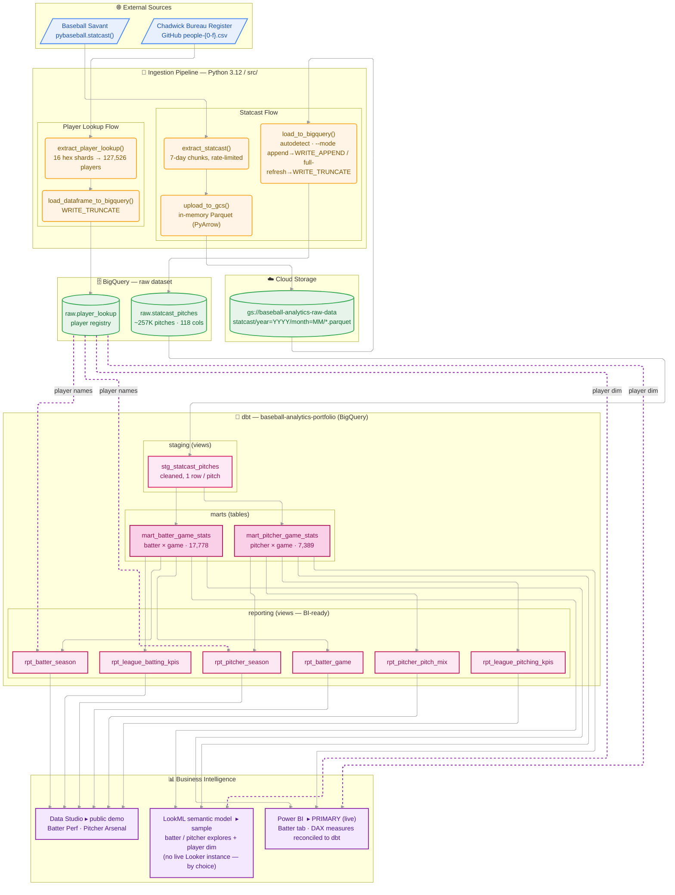

# System Architecture

End-to-end architecture of the baseball analytics portfolio: a Python ELT pipeline
that ingests pitch-level Statcast data into BigQuery, dbt models that transform it
into BI-ready layers, and **Power BI** as the primary dashboard — with a LookML
semantic-model sample and a public Data Studio demo.

> The standalone diagram source lives in [`architecture.mmd`](./architecture.mmd).
> This diagram uses the `elk` layout engine — it renders in the Mermaid Chart
> extension and mermaid.live, but some viewers (incl. GitHub) may fall back to a
> default layout.

## Layers

| Layer | Tech | Role |
| ----- | ---- | ---- |
| **Sources** | Baseball Savant, Chadwick Bureau | Pitch-level Statcast events + player ID registry |
| **Ingestion** | Python 3.12 (`src/`, `scripts/`) | Extract → GCS (Parquet) → BigQuery `raw` |
| **Storage** | GCS + BigQuery `raw` | Partitioned Parquet landing zone; append-only raw tables |
| **Transformation** | dbt + BigQuery | `staging` (views) → `marts` (tables) → `reporting` (views) |
| **BI (primary)** | Power BI (DAX reconciled to dbt) | Live primary build — KPI cards, leaderboards, EV-vs-launch-angle scatter |
| **BI (demo)** | Data Studio | Public no-login demo on the `reporting` views |
| **BI (sample)** | LookML semantic model | Alternative semantic-model sample — batter/pitcher explores + player dim (no live Looker instance, by choice) |
